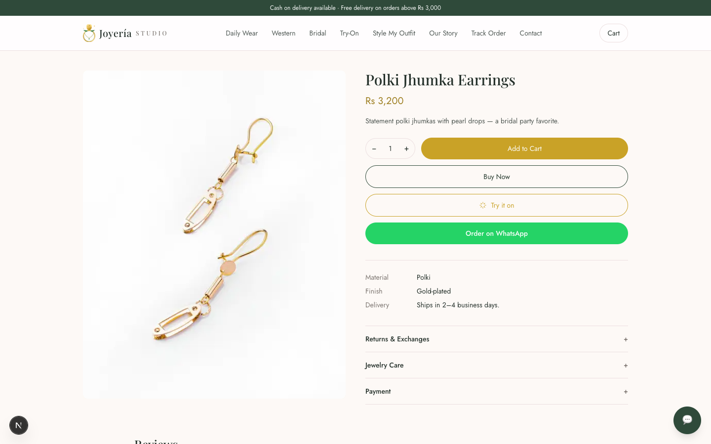
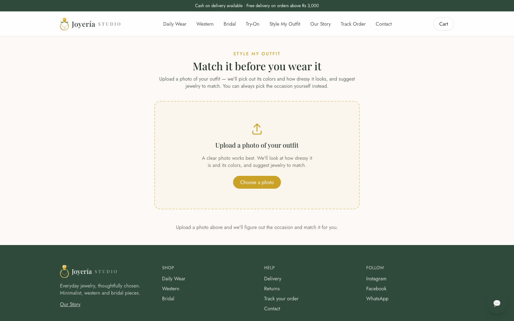
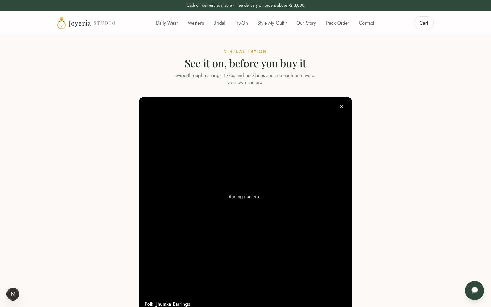
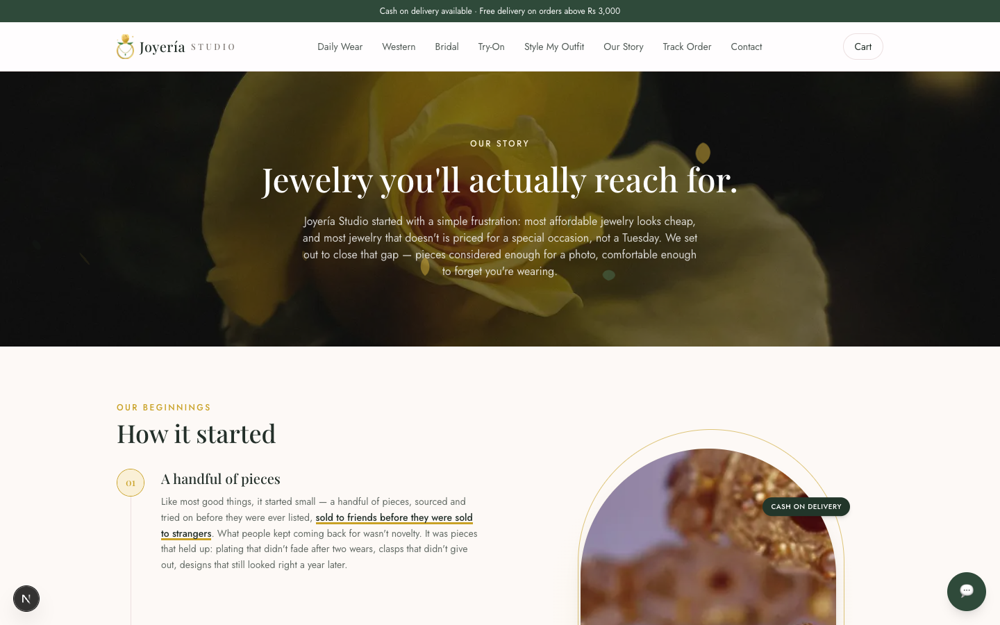

# Joyería Studio

Storefront for a Pakistani artificial jewelry business. Guest checkout with cash on
delivery, WhatsApp ordering, and stock-safe order placement — no customer accounts
required.

## Screenshots

| | |
|---|---|
|  |  |
| Home — hero, category shortcuts | Collection page — Newest / Price ↑ / Price ↓ sort |
|  |  |
| Product page — Try it on button next to Add to Cart | Style My Outfit — upload a photo, get matched jewelry |
|  |  |
| Virtual Try-On — live AR camera view | Our Story — 3D bridal showcase beside the pull-quote |

## Stack

Next.js (App Router) · TypeScript · Tailwind CSS v4 · Prisma · PostgreSQL · Zustand ·
Motion (Framer Motion) · Three.js · MediaPipe (FaceLandmarker) · Anthropic Claude API

## What's built

- **Catalog** — home page, collection pages with a segmented Newest / Price ↑ /
  Price ↓ sort control, product pages with gallery, related products, and
  `Product` JSON-LD for SEO. Category shortcuts live in the navbar's mega-menu
  rather than an in-page filter bar (`?category=` on the collection route still
  works, it's just not exposed as its own filter UI anymore) — an earlier
  material-filter + price-range-slider bar was simplified away in favor of this,
  since sort covers what shoppers actually reached for.
- **Virtual Try-On** (`/try-on`, plus a "Try it on" button next to Add to Cart on
  any product page with a try-on cutout set) — live AR earrings/tikka/necklace
  placement on the shopper's own camera feed, powered by MediaPipe's
  `FaceLandmarker` (468-point face mesh, GPU delegate with automatic CPU
  fallback) and plain Canvas 2D compositing (`components/tryon/VirtualTryOn.tsx`).
  Swipe or use the arrows to move between pieces; a camera on/off toggle
  (top-left) fully releases the media stream rather than just muting it. Only
  offered for a product once an admin uploads an isolated, transparent-background
  cutout for it (`Product.tryOnImageUrl`) — the regular catalog photo isn't
  reused, since overlaying it live would show as a pasted rectangle.
- **Style My Outfit** (`/style-my-outfit`) — upload a photo of an outfit and get
  a grid of matching jewelry, addable straight to cart or try-on. Occasion
  (daily/office, party, or bridal/wedding) is classified by sending the photo to
  Claude vision (`/api/outfit-style`) rather than a hand-tuned heuristic — an
  earlier pixel-edge-density approach couldn't tell a busy multi-item flatlay
  from genuinely embellished fabric, so real image understanding replaced it.
  Dominant colors are extracted client-side with a small from-scratch k-means
  pass (`lib/outfit-style.ts`) as a secondary tie-breaker. The detected occasion
  is always editable via chips if it's wrong.
- **Our Story** (`/our-story`) — brand narrative, values, a bridal callout, and a
  real-time 3D bridal jewelry showcase (Three.js, `components/motion/BridalShowcase3D.tsx`)
  rendered beside the page's pull-quote rather than behind it. The copy is
  placeholder-quality writing, not placeholder-quality *content* — but the
  specifics (founding year, founder, real numbers) are generic on purpose. Replace
  them with the real story before launch.
- **Cart & guest checkout** — Zustand cart persisted to `localStorage`, checkout form
  (name, phone, address, city, payment method), free delivery above a configurable
  threshold, plus an "Order on WhatsApp" button everywhere a customer might want one.
  Cash on delivery is only offered below a configurable order total
  (`ADVANCE_PAYMENT_THRESHOLD`, default Rs 5,000) — above it, the COD option is
  disabled in the form and rejected server-side on the re-priced total (`lib/payment.ts`),
  and the customer prepays via bank transfer, JazzCash or Easypaisa instead. There's no
  payment gateway, so this is full prepayment, not a partial deposit with COD for the
  rest — the simplest version of "advance payment required" this app can actually
  enforce without building real payment processing.
- **Product reviews** — a star rating + comment form on every product page
  (`components/ReviewForm.tsx`), guarded by the same honeypot pattern as checkout.
  Reviews are held back from the storefront (`Review.isApproved`, default `false`)
  until approved in `/admin/reviews` — unmoderated public free text is a spam vector
  like any other, and the admin dashboard surfaces a pending-review count the same
  way it does pending orders. Approved reviews feed a product's average rating,
  shown next to its title and folded into its `Product` JSON-LD as `aggregateRating`.
- **Return policy, jewelry care & payment terms** — a collapsible info section on
  every product page (`components/ProductPolicies.tsx`) covering exchanges (defects
  only, within 3 days, unworn), general jewelry care plus a product's own `careNote`
  when set, and the COD/advance-payment split above. Copy lives in `lib/policies.ts` —
  real writing, but placeholder specifics (day counts etc.) like the Our Story page;
  replace with your actual policy before launch.
- **Stock-safe orders** — `/api/checkout` re-prices the cart server-side inside a
  single Prisma transaction that also decrements stock, so two buyers can never both
  win the last piece. Coupon usage limits are enforced the same way (`updateMany`
  with the limit folded into the WHERE clause, not a read-then-write). Order
  numbers retry up to 3 times on the rare collision (`orderNumber` is `@unique`)
  rather than failing the whole checkout. Delivery fee is looked up per city
  (`DeliveryRate`), and a honeypot field + rate limiting (`lib/rate-limit.ts` —
  in-memory by default, switches to a shared Upstash Redis count when
  `UPSTASH_REDIS_REST_URL`/`_TOKEN` are set, since in-memory undercounts across
  Vercel's separate serverless instances) sit in front of it.
- **Order tracking** — `/track-order` looks orders up by phone number and returns
  only what the tracking page renders (status, items, city, courier info) — not
  the full row. Phone numbers aren't secret, so a lookup keyed only on one
  shouldn't also hand over the address, name or delivery phone on a lucky guess.
- **Admin panel** (`/admin`, NextAuth-protected) — orders (status/courier updates),
  products (create/edit/delete, with image upload straight to Cloudinary or a
  pasted URL, occasion tags — Daily/Office/Party Wear/Wedding — and color tags,
  both free-multi-select on the product form), collections (create/edit/delete),
  an Inventory view (`/admin/inventory` — item code, type, description and cost
  per product, plus total stock value and a missing-cost-price count), delivery
  rates per city (inline add/edit/delete), coupons (create/toggle/delete), review
  moderation (approve/delete), and an analytics dashboard (revenue trend, orders
  by status, top products by units sold, grouped by product ID so a rename
  doesn't split a product's own history into two rows — see `lib/analytics.ts`).
  Login itself is rate-limited (5 attempts / 5 min per IP) — it's the one endpoint
  where a correct guess gets straight into the admin panel, unlike everywhere
  else guarded by `AdminUser` credentials. Cancelling an order restores the stock
  it reserved at checkout (and re-reserves it, gated the same way a fresh
  checkout is, if un-cancelled) — cancellation is the normal way a refused or
  fake COD order gets filtered out, so this runs constantly, not as an edge case.
- **Customer support chatbot** — a floating widget (storefront only, hidden on
  `/admin`) backed by `/api/chat` and the Claude API, with a `track_order` tool
  Claude calls when a customer asks about an existing order — it looks the order
  up by phone (never guesses a status) and reports back only what the tool
  actually returns. Otherwise it's grounded in the live catalog/collections/delivery
  data pulled fresh from Postgres on every request (see `lib/chat-context.ts`) —
  small enough to include in full rather than needing vector search. Falls back
  to a "message us on WhatsApp" prompt if `ANTHROPIC_API_KEY` isn't set, or the
  catalog grows past what a single context window can hold (at which point swap
  `buildStoreContext()` for a real embedding search — nothing else depends on how
  that function is implemented).
- **SEO basics** — per-page metadata, `sitemap.ts`, `robots.ts`, JSON-LD on product
  pages.
- **Motion** — fade-up hero on load, scroll parallax + a one-time light-sweep on the
  hero photo, scroll-triggered section reveals (`components/motion/Reveal.tsx`), a
  scroll progress bar, product card hover (lift + shadow + crossfade to a second
  photo when one exists + a subtle sparkle on featured pieces), an "Add to bag"
  checkmark morph, a cart-badge bounce, a mobile nav drawer (there was no mobile nav
  before this — links were `hidden md:flex` with no fallback), an animated
  hover-underline on desktop nav, a shimmer skeleton for collection pages
  (`loading.tsx`), a click-to-zoom lightbox on product photos, and ambient floating
  rose/leaf petals genuinely rotated in 3D (`components/motion/FloatingPetals.tsx`
  — real `rotateX`/`rotateY`/`translateZ` inside a `perspective` container, not a
  flat fake) on the emotionally-led sections only: both hero sections and the
  bridal callouts. Deliberately left off checkout, cart and admin, where decoration
  would compete with someone trying to finish a task. (A larger illustrated flower
  centerpiece was tried and removed twice — a filled bloom read as clip-art, a
  line-art cluster still wasn't wanted; the small ambient petals are the version
  that stuck.) Kept restrained everywhere — motion
  durations stay under ~600ms, and the hero parallax respects
  `prefers-reduced-motion`.
- **Real rose photography** — the Our Story intro hero has one free-license photo
  from [Unsplash](https://unsplash.com/s/photos/rose) (`components/motion/PhotoAccent.tsx`),
  circular-framed, fully inset within the section (not bled off the edge — an
  earlier version clipped part of the circle against the section boundary, which
  looked broken rather than composed), hotlinked from Unsplash's CDN per their
  License (no attribution required). Only one placement: a second copy in the
  bridal callout was redundant next to the real bridal product photo already
  there and got removed. Deliberately static, not the 3D rotation used
  on the icon illustrations — spinning an actual photograph in 3D reads as a
  gimmick, not a product shot.

Not built yet: bank transfer/JazzCash/Easypaisa screenshot upload (the
`Order.paymentProofUrl` column exists for this), and coupon UI in the checkout
form (the backend already validates `couponCode`). Try-On also needs an admin to
actually upload a transparent-cutout image per product before it does anything
on the storefront — the feature ships empty until that happens.

## Setup

```bash
npm install
cp .env.example .env   # fill in DATABASE_URL at minimum
npm run db:push        # create tables from prisma/schema.prisma
npm run db:seed        # load sample products, collections, delivery rates, a coupon
npm run dev
```

Open http://localhost:3000.

### Local database

For local development you can run Postgres via Homebrew (`brew install
postgresql@16`) or Docker. Point `DATABASE_URL` at it. For production, use a free
[Neon](https://neon.tech) Postgres database — just swap the connection string.

### Environment variables

See `.env.example`. The two that matter immediately:

- `DATABASE_URL` — your Postgres connection string.
- `NEXT_PUBLIC_WHATSAPP_NUMBER` — the number "Order on WhatsApp" and order
  confirmation messages point at (digits only, with country code, e.g.
  `923001234567`).

`ORDER_NOTIFY_WEBHOOK_URL` is optional — point it at a Slack/Discord incoming
webhook and every new order posts a one-line summary there.

`ANTHROPIC_API_KEY` is optional — without it the chat widget shows a WhatsApp
fallback instead of erroring, and the Style My Outfit page's occasion detection
returns a clear error asking the shopper to pick an occasion manually instead
(both features share this one key). Get one at https://console.anthropic.com.

`CLOUDINARY_CLOUD_NAME` / `CLOUDINARY_API_KEY` / `CLOUDINARY_API_SECRET` are
optional — without them, admin image uploads return a clear error and admins
can still paste an image URL directly instead. Free tier at
https://cloudinary.com/console is enough.

`NEXT_PUBLIC_INSTAGRAM_URL` / `NEXT_PUBLIC_FACEBOOK_URL` are optional — set them
to show real links in the footer and the homepage's "Follow Along" section
(hidden entirely when unset, rather than linking nowhere).

Virtual Try-On and the 3D bridal showcase need no extra configuration — they
run entirely client-side (MediaPipe and Three.js assets are fetched from
`public/`), but Try-On does need at least one product with `tryOnImageUrl` set
before it shows anything on the storefront.

## Data model notes

- Prices are whole PKR integers — no float rounding anywhere.
- `OrderItem` snapshots `productName` and `price` at purchase time, and
  `productId` is nullable, so deleting or repricing a product never rewrites past
  orders.
- `Product.costPrice` is never selected on any storefront query — admin-only,
  surfaced in the Inventory page's stock-value total.
- Every order starts `PENDING`. The plan is to confirm real orders over WhatsApp
  (there's a "Confirm on WhatsApp" button on the success page) before moving them to
  `CONFIRMED` and shipping — this is what keeps fake COD orders from clogging the
  pipeline.

## Next steps

1. Upload transparent-cutout Try-On images for the earrings/tikka/necklace
   catalog — the feature is fully built but shows nothing until at least one
   product has `tryOnImageUrl` set via the admin.
2. Bank transfer / JazzCash / Easypaisa with screenshot upload (`Order.paymentProofUrl`
   already exists for this).
3. Coupon UI in the checkout form (the backend already validates `couponCode`).
4. Real product photography — swap the plain-background placeholder SVGs in
   `public/products/` for actual shots via the admin.
5. Deploy: Vercel + Neon + Cloudinary + Resend, `prisma migrate deploy` on release.
